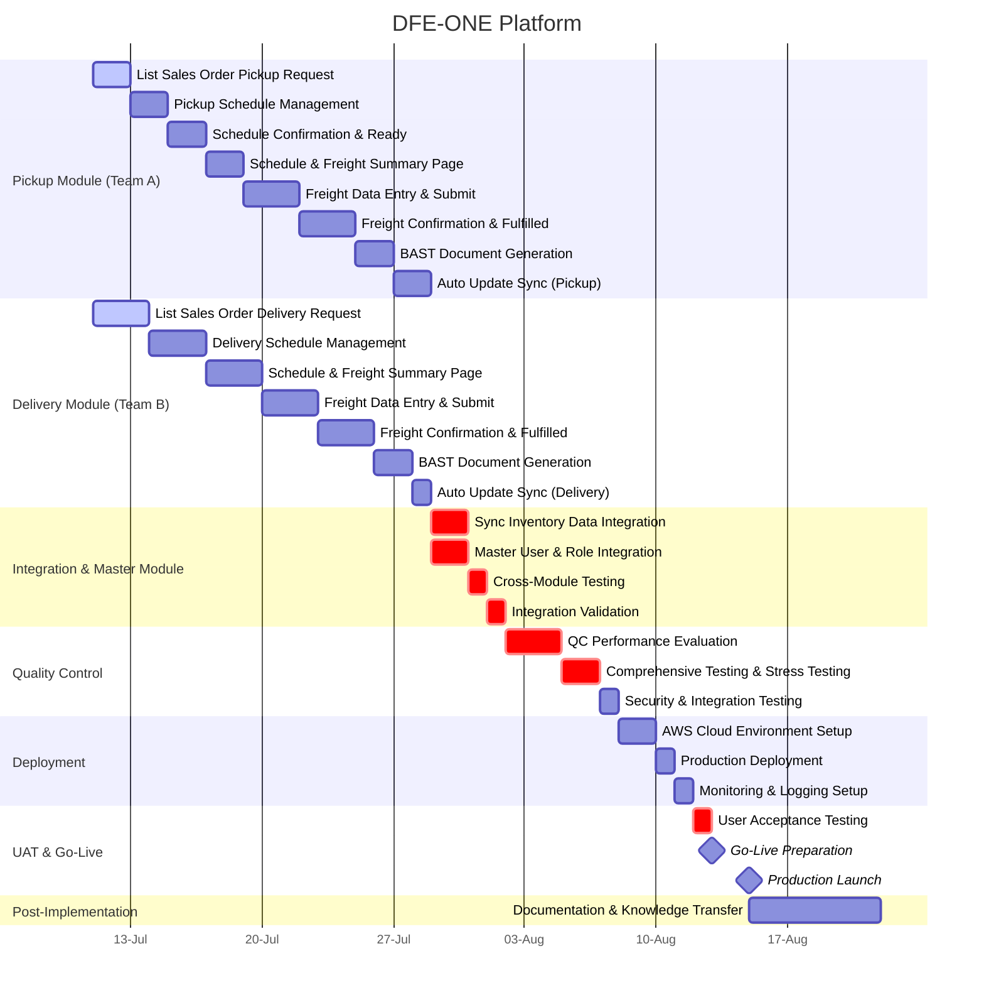

# Timeline DFE One - INDICO

```mermaid
gantt
    title DFE-ONE Platform
    dateFormat  YYYY-MM-DD
    axisFormat  %d-%b
    todayMarker on

    section Pickup Module (Team A)
    List Sales Order Pickup Request              :active, pickup1, 2025-07-11, 2d
    Pickup Schedule Management                   :pickup2, after pickup1, 2d
    Schedule Confirmation & Ready                :pickup3, after pickup2, 2d
    Schedule & Freight Summary Page              :pickup4, after pickup3, 2d
    Freight Data Entry & Submit                  :pickup5, after pickup4, 3d
    Freight Confirmation & Fulfilled             :pickup6, after pickup5, 3d
    BAST Document Generation                     :pickup7, after pickup6, 2d
    Auto Update Sync (Pickup)                    :pickup8, after pickup7, 2d

    section Delivery Module (Team B)
    List Sales Order Delivery Request            :active, delivery1, 2025-07-11, 3d
    Delivery Schedule Management                 :delivery2, after delivery1, 3d
    Schedule & Freight Summary Page              :delivery3, after delivery2, 3d
    Freight Data Entry & Submit                  :delivery4, after delivery3, 3d
    Freight Confirmation & Fulfilled             :delivery5, after delivery4, 3d
    BAST Document Generation                     :delivery6, after delivery5, 2d
    Auto Update Sync (Delivery)                  :delivery7, after delivery6, 1d

    section Integration & Master Module
    Sync Inventory Data Integration              :crit, integration1, after pickup8, 2d
    Master User & Role Integration               :crit, integration2, after delivery7, 2d
    Cross-Module Testing                         :crit, integration3, after integration1, 1d
    Integration Validation                       :crit, integration4, after integration3, 1d

    section Quality Control
    QC Performance Evaluation                    :crit, qc1, after integration4, 3d
    Comprehensive Testing & Stress Testing       :crit, qc2, after qc1, 2d
    Security & Integration Testing               :qc3, after qc2, 1d

    section Deployment
    AWS Cloud Environment Setup                  :deploy1, after qc3, 2d
    Production Deployment                        :deploy2, after deploy1, 1d
    Monitoring & Logging Setup                   :deploy3, after deploy2, 1d

    section UAT & Go-Live
    User Acceptance Testing                      :crit, uat, after deploy3, 1d
    Go-Live Preparation                          :milestone, golive, after uat, 0d
    Production Launch                            :milestone, launch, 2025-08-15, 0d

    section Post-Implementation
    Documentation & Knowledge Transfer           :docs, after launch, 7d
```