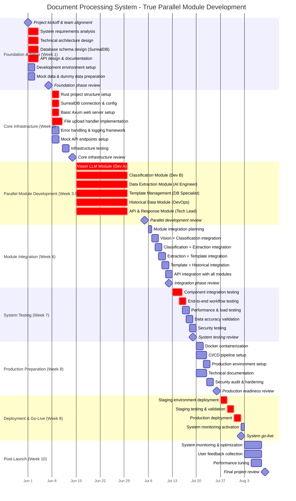

# Document Processing System - Comprehensive Implementation Timeline

Berdasarkan analisis dokumentasi sistem pemrosesan dokumen cerdas, berikut adalah timeline implementasi yang komprehensif dan realistis:

## 📋 **True Parallel Module Development Strategy**

### **Week 1: Foundation & Mock Data Setup**
**Developer A**: System requirements analysis (3d)
**Developer B**: Technical architecture design (3d)
**Database Specialist**: Database schema design SurrealDB (3d)
**AI/LLM Engineer**: API design & documentation (3d)
**DevOps Engineer**: Development environment setup (2d)
**Tech Lead**: Mock data & dummy data preparation (2d)

**Key Output**: Mock/dummy data untuk semua modules:
- Sample document images (different types)
- Mock classification results
- Dummy extraction outputs
- Sample template data
- Mock historical data

### **Week 2: Core Infrastructure**
**All Team**: Setup basic infrastructure yang dibutuhkan semua modules
- Rust project structure dengan module separation
- Basic Axum server dengan mock endpoints
- SurrealDB connection untuk semua modules
- File upload handler
- Mock API responses untuk testing

### **Week 3-5: TRUE PARALLEL MODULE DEVELOPMENT (THE GAME CHANGER!)**

#### **🔥 Developer A: Vision LLM Module (15 days)**
**Week 3**:
- Vision LLM API client development (3d)
- OCR text extraction module (3d) - using mock images
- Image preprocessing pipeline (1d)

**Week 4**:
- Text cleaning & normalization (2d)
- Confidence scoring algorithm (3d)
- Vision module testing dengan mock data (2d)

**Week 5**:
- Vision LLM optimization (2d)
- Error handling untuk Vision module (2d)
- Documentation & unit tests (1d)

#### **🎯 Developer B: Classification Module (15 days)**
**Week 3**:
- Document type definitions (2d)
- Keyword-based classification (3d) - using mock text data

**Week 4**:
- LLM-based classification (3d) - using mock prompts
- Hybrid classification logic (2d)

**Week 5**:
- Classification confidence merger (2d)
- Classification testing & tuning dengan mock data (3d)
- Performance optimization (2d)

#### **🤖 AI/LLM Engineer: Data Extraction Module (15 days)**
**Week 3**:
- Field-specific extraction logic (4d) - using mock documents
- Structured data parsing (1d)

**Week 4**:
- JSON schema validation (2d)
- Business rules engine (3d) - using dummy business rules

**Week 5**:
- Data validation framework (3d)
- Pattern matching implementation (2d)
- Extraction testing dengan mock data (2d)

#### **📊 Database Specialist: Template Management Module (15 days)**
**Week 3**:
- Template schema design (2d)
- Template storage in SurrealDB (3d)

**Week 4**:
- Template CRUD operations (3d) - using mock templates
- Template versioning system (2d)

**Week 5**:
- Template caching layer (2d)
- Dynamic prompt generation (3d) - using mock prompts
- Template management testing (2d)

#### **🛠️ DevOps Engineer: Historical Data Module (15 days)**
**Week 3**:
- Historical data schema design (2d)
- SurrealDB historical storage (3d)

**Week 4**:
- Audit trail implementation (2d)
- Processing analytics module (3d) - using mock processing data

**Week 5**:
- Performance metrics collection (2d)
- Analytics dashboard backend (3d) - using mock analytics
- Monitoring setup (2d)

#### **🚀 Tech Lead: API & Response Module (15 days)**
**Week 3**:
- RESTful API endpoints development (3d)
- Request/Response models (2d)

**Week 4**:
- API documentation generation (2d)
- Response metadata enhancement (3d)

**Week 5**:
- API rate limiting & security (2d)
- API testing suite dengan mock data (3d)
- API performance optimization (2d)

### **Week 6: Module Integration - Step by Step**
**Day 1**: Integration planning - semua module owners koordinasi
**Day 2-3**: Vision + Classification integration - replace mock dengan real data flow
**Day 4-5**: Classification + Extraction integration - connect classification output ke extraction input
**Day 6-7**: Extraction + Template integration - template selection based on classification
**Day 8-9**: Template + Historical integration - store results to historical data
**Day 10-11**: API integration - connect all modules through unified API
**Day 12**: Integration testing & validation

### **Week 7: System Testing**
**All team** testing sistem yang sudah terintegrasi:
- Component integration testing (3d)
- End-to-end workflow testing (2d)
- Performance & load testing (2d)
- Data accuracy validation (2d)
- Security testing (2d)

### **Week 8: Production Preparation**
**Parallel production prep**:
- Docker containerization (2d)
- CI/CD pipeline setup (3d)
- Production environment setup (2d)
- Technical documentation (3d)
- Security audit (2d)

### **Week 9: Deployment & Go-Live**
**Coordinated deployment**:
- Staging deployment (2d)
- Staging testing (2d)
- Production deployment (2d)
- Go-live (1d)

### **Week 10: Post-Launch**
**Support & optimization** (5d)

## 🎯 **Key Deliverables per Phase:**

1. **Planning**: Architecture docs, DB schema, API specs
2. **Foundation**: Working Rust web server dengan basic endpoints
3. **Vision LLM**: OCR dan image processing capabilities
4. **Classification**: Document type identification system
5. **Template**: Dynamic template management system
6. **Extraction**: Structured data extraction engine
7. **Historical**: Data storage dan analytics backend
8. **API**: Complete RESTful API dengan documentation
9. **Testing**: Fully tested dan validated system
10. **Deployment**: Production-ready system dengan monitoring

## ⚠️ **Critical Path & Dependencies:**

- **Vision LLM Integration** adalah bottleneck utama - harus stable sebelum classification
- **Template System** harus selesai sebelum data extraction
- **SurrealDB Schema** harus final sebelum historical data implementation
- **Testing Phase** membutuhkan semua component selesai

## 📊 **Aggressive Parallel Team Structure (6 People):**

### **Sprint-based Team Composition:**
- **1 Technical Lead** - Sprint coordination, architecture decisions, integration oversight
- **2 Senior Rust Developers** - Core backend development, feature implementation
- **1 Database Specialist** - SurrealDB optimization, data architecture, performance tuning
- **1 AI/LLM Engineer** - Vision LLM integration, prompt engineering, accuracy optimization
- **1 DevOps Engineer** - Infrastructure, CI/CD, monitoring, deployment automation

### **Weekly Sprint Allocation:**
- **Sprint 1 (Foundation)**: Everyone on setup - parallel architecture work
- **Sprint 2 (Infrastructure)**: 6 parallel infrastructure tracks
- **Sprint 3 (Features)**: **KEY SPRINT** - 6 major features simultaneously
- **Sprint 4 (Integration)**: 6 specialized teams for integration + optimization
- **Sprint 5 (Testing)**: 6 testing teams running comprehensive parallel tests
- **Sprint 6 (Production)**: 6 production-ready teams for final deployment prep

### **Communication & Coordination:**
- **Daily Standups** (15 min) - sync progress, identify blockers
- **Sprint Reviews** (1 hour) - demo working features, plan next sprint
- **Integration Sessions** (2x per week) - ensure components work together
- **Technical Debt Management** - continuous refactoring during development

### **Technology Stack:**
- **Backend**: Rust + Axum framework
- **Database**: SurrealDB (multi-model database)
- **AI/LLM**: OpenAI GPT-4V atau Claude 3.5 Sonnet
- **Containerization**: Docker + Kubernetes
- **CI/CD**: GitHub Actions
- **Monitoring**: Prometheus + Grafana

## 📈 **Success Metrics:**

### **Performance Targets:**
- **Response Time**: < 5 seconds per document
- **Accuracy**: > 90% classification accuracy
- **Throughput**: > 100 documents per minute
- **Availability**: 99.9% uptime

### **Business KPIs:**
- **Processing Efficiency**: 80% reduction in manual document processing
- **Error Rate**: < 5% data extraction errors
- **User Satisfaction**: > 4.5/5 rating
- **Cost Reduction**: 60% reduction in operational costs

## 🚀 **Next Steps (Starting June 1, 2025):**

1. **Immediate Actions**:
   - Finalize Vision LLM provider selection
   - Setup development environment
   - Create project repository structure
   - Begin system requirements documentation

2. **Week 1 Priorities**:
   - Complete system requirements analysis
   - Finalize technical architecture design
   - Design SurrealDB schema
   - Create API documentation templates

3. **Risk Mitigation**:
   - Setup fallback LLM providers
   - Plan for scalability requirements
   - Prepare contingency timeline
   - Establish testing protocols
