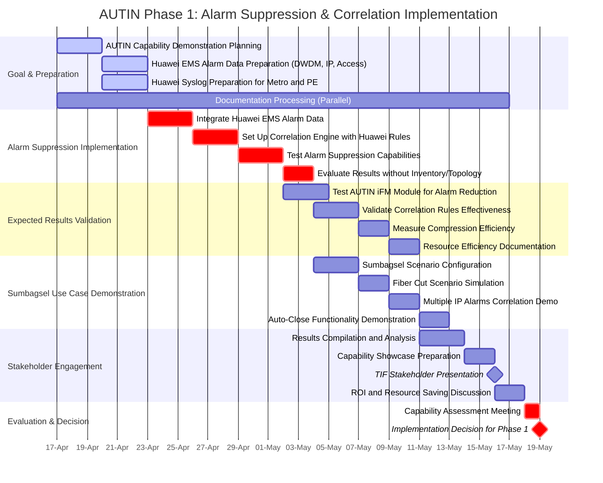

# AUTIN PoC for TIF - Comprehensive Implementation Timeline

## Phase 1 Detailed Implementation Timeline: Alarm Compression & Correlation

### Journey Plan:

1. **Goal Integration**:
   - Explicitly focuses on testing "alarm suppression in iFM module using Huawei EMS alarm data only" as stated in the journey plan

2. **Data Sources Specified**:
   - Includes the exact data sources mentioned in the pre-requisites:
     - "Huawei EMS data from DWDM, IP, Access"
     - "Syslog data for Metro and PE"

3. **Key Actions Incorporated**:
   - Added specific tasks that match the key actions in the journey plan:
     - "Integrate Huawei EMS alarm data (DWDM, IP, Access)"
     - "Set up correlation engine using Huawei's rules"
     - "Test alarm suppression capabilities"
     - "Evaluate results without inventory or topology data"

4. **Expected Results Validation**:
   - Includes tasks to validate all the expected results in the journey plan:
     - "Test AUTIN iFM module for alarm reduction"
     - "Validate correlation rules from Huawei's experience"
     - "Evaluate alarm suppression effectiveness"

5. **Sumbagsel Focus**:
   - Added a dedicated section for Sumbagsel case demonstration based on the concern raised in the MoM about the need to show capability with Sumbagsel-specific cases

This timeline now perfectly aligns with the journey plan while maintaining a practical implementation approach that doesn't require TIF data or wait for Nodin approval. It demonstrates how we can achieve the goals outlined in Chapter 1 using only Huawei's data and expertise.
