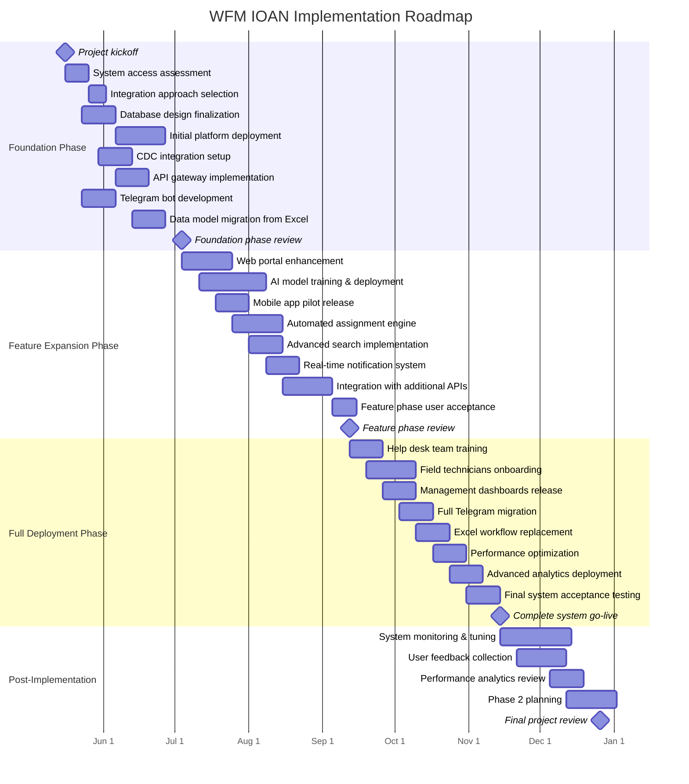

# WFM IOAN Timeline

```mermaid
gantt
    title WFM IOAN Implementation Roadmap
    dateFormat  YYYY-MM-DD
    axisFormat %b %e
    todayMarker on
    
    section Foundation Phase
    Project kickoff                    :milestone, 2025-05-16, 0d
    System access assessment           :assess, 2025-05-16, 10d
    Integration approach selection     :after assess, 7d
    Database design finalization       :2025-05-23, 14d
    Initial platform deployment        :2025-06-06, 21d
    CDC integration setup              :2025-05-30, 14d
    API gateway implementation         :2025-06-06, 14d
    Telegram bot development           :2025-05-23, 14d
    Data model migration from Excel    :2025-06-13, 14d
    Foundation phase review            :milestone, 2025-07-04, 0d
    
    section Feature Expansion Phase
    Web portal enhancement             :2025-07-04, 21d
    AI model training & deployment     :2025-07-11, 28d
    Mobile app pilot release           :2025-07-18, 14d
    Automated assignment engine        :2025-07-25, 21d
    Advanced search implementation     :2025-08-01, 14d
    Real-time notification system      :2025-08-08, 14d
    Integration with additional APIs   :2025-08-15, 21d
    Feature phase user acceptance      :2025-09-05, 10d
    Feature phase review               :milestone, 2025-09-12, 0d
    
    section Full Deployment Phase
    Help desk team training            :2025-09-12, 14d
    Field technicians onboarding       :2025-09-19, 21d
    Management dashboards release      :2025-09-26, 14d
    Full Telegram migration            :2025-10-03, 14d
    Excel workflow replacement         :2025-10-10, 14d
    Performance optimization           :2025-10-17, 14d
    Advanced analytics deployment      :2025-10-24, 14d
    Final system acceptance testing    :2025-10-31, 14d
    Complete system go-live            :milestone, 2025-11-14, 0d
    
    section Post-Implementation
    System monitoring & tuning         :2025-11-14, 30d
    User feedback collection           :2025-11-21, 21d
    Performance analytics review       :2025-12-05, 14d
    Phase 2 planning                   :2025-12-12, 21d
    Final project review               :milestone, 2025-12-26, 0d
```